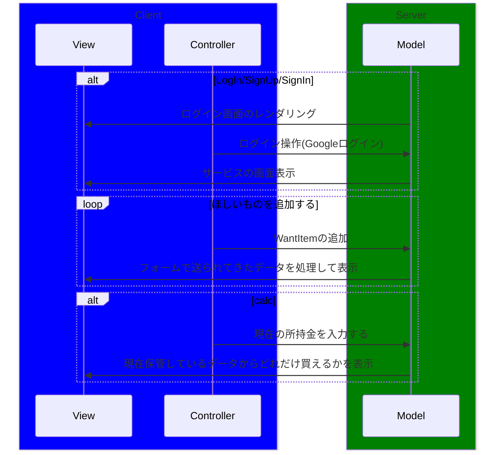

# ほしいものリストの話
- Amazonのほしいものリストって、Amazonにある分しか登録できない
- Amazon以外のほしいものリストを作成しておきたい（理由：忘れん坊だし）
- 今の所持金で何を買う余裕があるかを自動で計算してくれるソフトが欲しい
作ってしまおう！

## 必要なアルゴリズム
- 買える分は全部買いたい
- これは「詰められる範囲でいっぱいものをつめたい」という**ナップサック問題**と類似している
- 上記問題の最適化として動的計画法が使われている
  **動的計画法**のアルゴリズムを使います

## ダイアグラム作成

